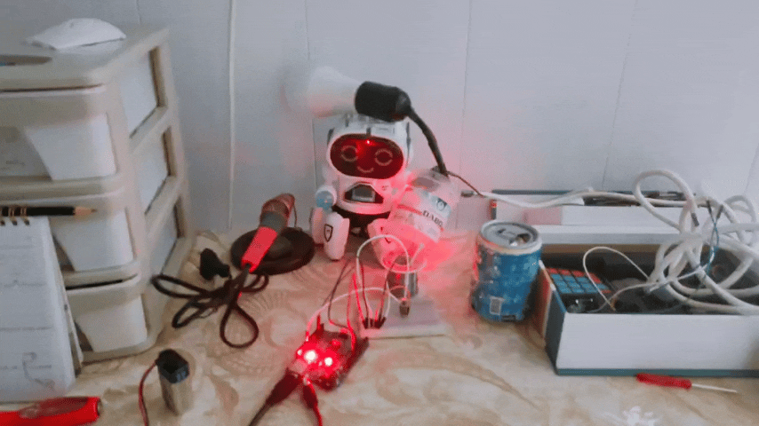
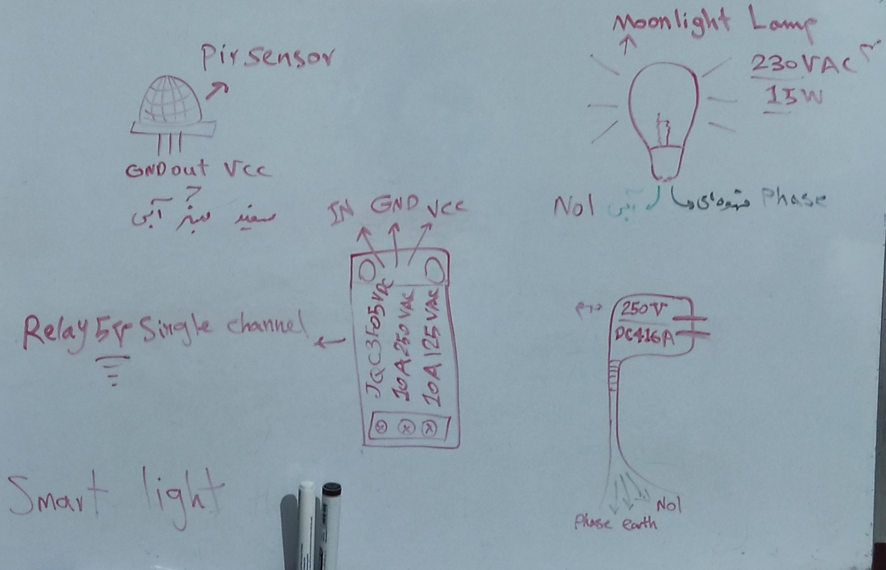

<div align="center">

# 💡 IR Remote  Controlled Lamp 

## ✨ Wireless control for your moonlight lamp ✨

[](https://arduino.cc)
[](https://isocpp.org/)
[](https://github.com/Arduino-IRremote/Arduino-IRremote)
[](LICENSE)

</div>

---

### 🕹️ Turn your 230VAC lamp on/off using any standard IR remote

✅ Easy to build  
✅ Perfect for bedroom or living room  
✅ Arduino + IR receiver module

---
### 🎥 Demo (Plz wait for loading...) 
<div align="center">


🎬 **Demo:** Lamp toggles with every button press (for me is ON/OFF)

</div>

---

### 🌟 **Features at a Glance**

| Feature | Description |
|---------|-------------|
| 🎮 **Wireless Control** | Operate from up to 10 meters away |
| 🔄 **Toggle Function** | One button - ON/OFF control |
| ⚡ **Quick Response** | Instant switching with debounce protection |
| 📟 **Serial Feedback** | Real-time status monitoring |
| 🔌 **Simple Setup** | Only 3 wires to connect! |
| 💰 **Budget Friendly** | Under $10 for the entire setup |

---

## 📋 Table of Contents
- [Overview](#overview)
- [Components Used](#components-used)
- [Circuit Wiring](#circuit-wiring)
- [Pin Connections](#pin-connections)
- [How It Works](#how-it-works)
- [Code Explanation](#code-explanation)
- [Installation](#installation)
- [Usage](#usage)
- [Safety Warnings](#safety-warnings-⚠️)
- [Troubleshooting](#troubleshooting)
- [Customization](#customization)
- [License](#license)

---

## 🎯 Overview

This project transforms your ordinary **Moonlight 230VAC 15W lamp** into a smart, remote-controlled lighting system. Using an **IR receiver sensor** and a **5V relay module**, you can toggle your lamp ON/OFF from across the room with any standard IR remote control.

### Features:
- ✅ Wireless control up to 10 meters
- ✅ Debounced input (no accidental toggling)
- ✅ Serial monitor feedback
- ✅ Works with any NEC protocol remote
- ✅ Low power consumption

---

## 🧩 Components Used

| Component | Specification | Quantity |
|-----------|--------------|----------|
| Arduino Board | Uno/Nano/Mega | 1 |
| IR Receiver Sensor | VS1838B / Any 38kHz | 1 |
| Relay Module | 5V Single Channel | 1 |
| Moonlight Lamp | 230VAC 15W | 1 |
| Jumper Wires | Male-Female / Male-Male | 5-6 |
| IR Remote | Any NEC protocol | 1 |

---

## 🔌 Circuit Wiring

### System Overview
```
          ┌─────────────┐
          │   Arduino   │
          │             │
          │  Pin 11 ◄───┼──── IR Receiver
          │  Pin 3  ──► ┼──── Relay Module
          │  5V     ──► ┼────┐
          │  GND    ──► ┼────┼──── Common Ground & Power
          └─────────────┘    │
                    │         │
                    ▼         ▼
              ┌─────────┐  ┌─────────┐
              │  Relay  │  │   IR    │
              │ Module  │  │ Sensor  │
              └────┬────┘  └─────────┘
                   │
                   ▼
            ┌─────────────┐
            │    Lamp     │
            │  230VAC 15W │
            └─────────────┘
```

### Detailed Wiring Instructions

#### 🔴 IR Receiver Sensor (Pin 11)
| Sensor Pin | Connect To |
|------------|------------|
| VCC (Left) | Arduino 5V |
| GND (Right) | Arduino GND |
| OUT (Center) | Arduino Pin 11 |

#### 🟢 Relay Module (Pin 3)
| Relay Pin | Connect To |
|-----------|------------|
| VCC | Arduino 5V |
| GND | Arduino GND |
| IN (Signal) | Arduino Pin 3 |

#### 💡 Lamp Wiring (230VAC ⚠️)
| Terminal | Connection |
|----------|------------|
| Live Wire (Brown/Red) | Relay COM terminal |
| Relay NO terminal | Lamp Live input |
| Neutral Wire (Blue/Black) | Direct to Lamp Neutral |
| **Earth Wire (Green/Yellow)** | Lamp Earth terminal |

```
AC Mains (230V)
    │
    ├── Live ───► Relay COM ───► Relay NO ───► Lamp Live
    │
    └── Neutral ─────────────────────────────► Lamp Neutral
```

---

## 📊 Pin Connections

| Arduino Pin | Connected To | Purpose |
|-------------|--------------|---------|
| **Pin 3** | Relay IN | Control lamp (HIGH=OFF, LOW=ON) |
| **Pin 11** | IR Receiver OUT | Receive IR signals |
| **5V** | Relay VCC + IR VCC | Power supply |
| **GND** | Relay GND + IR GND | Common ground |

> **Note:** All VCC and GND are connected in parallel (common power/ground)

---

## ⚙️ How It Works

1. **IR Receiver** constantly listens for infrared signals from your remote
2. When you press a button, it captures the **unique hex code** (e.g., `0xBA45FF00`)
3. Arduino compares the received code with your `targetCode`
4. If matched and debounce time passed (>250ms):
   - **Toggles relay state** (ON ↔ OFF)
   - Updates `lightState` variable
   - Prints status to Serial Monitor
5. Relay switches the **230VAC lamp circuit** ON/OFF

---

## 💻 Code Explanation

### Key Variables
```cpp
const int relayPin = 3;           // Relay control pin
const int irPin = 11;             // IR sensor input pin
const unsigned long targetCode = 0xBA45FF00;  // Your remote's button code
bool lightState = false;          // Current lamp state (OFF initially)
unsigned long lastPressTime = 0;  // Debounce timer
```

### Setup Function
```cpp
pinMode(relayPin, OUTPUT);
digitalWrite(relayPin, HIGH);     // Relay OFF (Lamp OFF)
IrReceiver.begin(irPin, ENABLE_LED_FEEDBACK);  // Start IR receiver
```

### Main Loop Logic
```cpp
if (IrReceiver.decode()) {         // Signal received?
  if (code matches && debounce) {  // Valid button press?
    lightState = !lightState;      // Toggle state
    digitalWrite(relayPin, lightState ? LOW : HIGH);  // Control relay
  }
  IrReceiver.resume();             // Ready for next signal
}
```

---

## 📥 Installation

### 1. Install Required Library
```bash
# In Arduino IDE:
Sketch → Include Library → Manage Libraries → Search "IRremote" → Install
```

### 2. Get Your Remote's IR Code
Upload this test sketch to find your button code:

```cpp
#include <IRremote.h>

void setup() {
  Serial.begin(9600);
  IrReceiver.begin(11);
  Serial.println("Press any button on your remote");
}

void loop() {
  if (IrReceiver.decode()) {
    Serial.print("Code: 0x");
    Serial.println(IrReceiver.decodedIRData.decodedRawData, HEX);
    IrReceiver.resume();
  }
}
```

> **Replace `0xBA45FF00`** in the main code with the code you received!

### 3. Upload Main Sketch
1. Open `ir_relay_control.ino` in Arduino IDE
2. Select your board (Tools → Board → Arduino Uno/Nano)
3. Select correct COM port
4. Click **Upload** (→)

---

## 🎮 Usage

1. **Power on** your Arduino (USB or 9V adapter)
2. **Open Serial Monitor** (9600 baud) to see status messages
3. **Point your IR remote** at the receiver (within 10 meters)
4. **Press the programmed button** → Lamp toggles ON
5. **Press again** → Lamp toggles OFF
6. Serial Monitor shows:
   ```
   IR Ready - Press the programmed button
   ON
   OFF
   ON
   ```

---

## ⚠️ Safety Warnings

> **🚨 HIGH VOLTAGE WARNING - 230VAC**
> 
> This project involves **mains voltage (230VAC)** which can cause **electric shock or death**!

### Mandatory Safety Precautions:
- ✅ **Disconnect power** before wiring the lamp
- ✅ Use **insulated tools** only
- ✅ Place everything in a **non-conductive enclosure**
- ✅ **Heat shrink tubing** on all AC connections
- ✅ Keep **high voltage away** from low voltage circuits
- ✅ **Double-check wiring** before powering on
- ✅ Add a **fuse** (1A slow-blow) on live wire
- ✅ **Never touch** wires while powered

### Recommended:
- Use a **pre-wired relay module** with opto-isolation
- Add a **status LED** to indicate relay state
- Use **wire nuts** or **WAGO connectors** for AC wiring

---

## 🔧 Troubleshooting

| Problem | Possible Cause | Solution |
|---------|---------------|----------|
| **Lamp doesn't turn ON** | Wrong IR code | Find correct code using test sketch |
| | Relay wired wrong | Check COM → Lamp → NO connection |
| | Relay failed | Test relay with LED + resistor first |
| **Random toggling** | No debounce | Increase delay: change `250` to `300` |
| | IR interference | Shield receiver from sunlight/CFL |
| **No serial output** | Wrong baud rate | Set Serial Monitor to **9600** |
| | Wrong pin | Ensure IR sensor on Pin 11 |
| **Lamp flickers** | Loose connection | Check all AC wire connections |
| | Relay chattering | Add 10µF capacitor across relay VCC/GND |
| **Short range** | Low battery | Replace remote battery |
| | Obstruction | Clear line-of-sight to sensor |

---

## 🎨 Customization

### Add Multiple Lamps
```cpp
const int relayPin2 = 4;
const unsigned long targetCode2 = 0xFF10EF00;

// In loop()
if (code == targetCode2) {
  digitalWrite(relayPin2, !digitalRead(relayPin2));
}
```

### Add Status LED
```cpp
const int ledPin = 13;
pinMode(ledPin, OUTPUT);
digitalWrite(ledPin, lightState ? HIGH : LOW);
```

### Add EEPROM Memory (Save state after power loss)
```cpp
#include <EEPROM.h>
lightState = EEPROM.read(0);
digitalWrite(relayPin, lightState ? LOW : HIGH);
```

---

## 📁 Project Structure

``` text
arduino-ir-relay-control/
│
├── ir_relay_control.ino          # Main Arduino sketch
├── README.md                      # Project documentation
├── LICENSE                        # MIT License
├── IRremote.h                     # IR library header
├── Arduino-IRremote-master.zip    # Library archive (backup)
│
├── .vscode/                       # VS Code configuration
│   ├── c_cpp_properties.json
│   └── settings.json
│
└── images/                        # Documentation assets
    ├── lamp.gif                   # Live demo animation
    └── pir-sensor.jpg             # Wiring reference image
```

---

## 📜 License

This project is released under the **MIT License**  so you're free to use, modify, share, and even build commercial products with it. No strings attached, just open-source love.

---

## 🙏 Acknowledgments

Big thanks to the people and projects that made this possible:

- **[IRremote Library](https://github.com/Arduino-IRremote/Arduino-IRremote)** by Ken Shirriff, z3t0, and ArminJo — the backbone of this project
- **The Arduino Community** — for endless inspiration, forums, and support
- **Every open-source hardware contributor** — keeping the spirit of DIY alive

---

## 📞 Support

Running into trouble? Try these troubleshooting steps first:

1. 🔌 **Double-check your wiring** — a loose connection is the #1 culprit
2. 🧪 **Test the relay separately** — upload a basic blink sketch to isolate issues
3. 📡 **Verify your IR receiver** — test with any TV remote using the IRrecvDemo sketch
4. 🐛 **Still stuck?** — [Open an issue on GitHub](https://github.com/VIDAKHOSHPEY22/your-repo-name/issues) and I'll take a look

---

## 🎨 The "Totally Worked in Theory" Section

> *Warning: What you're about to see is a beautiful dream that reality rejected😂😂.*

I had this **brilliant idea** . why not use a PIR motion sensor? The lamp turns on automatically when someone walks by! Genius, right?

So I drew my master plan on a whiteboard:



*🎨 "Trust me, I'm an engineer" 😑😂 probably me, right before everything went wrong*

---

### ❌ Reality:
- My PIR sensor had ✨**anxiety**✨ 😣 it kept triggering for NO reason
- Filtered it? Still noisy.
- Added capacitors? Still dramatic.
- Talked to it nicely? Ignored me completely.

### 🧠 What I learned:
Sometimes the universe says *"not today, buddy"*.  
So I stuck with the **IR remote** — it's loyal, quiet, and doesn't have emotional breakdowns.

### 🤗 A gentle note for future coders:
If you're braver than me and want to try PIR + relay + AC power:
- Keep the sensor FAR from the relay (like, socially distant far)
- Use shielded cables (they're like emotional support wires)
- Add a big capacitor (100µF) — it's basically therapy for electronics

**Or just use IR remote like a peaceful person. No shame. 😌**

---

❤️ *This whiteboard drawing now lives here forever as a monument to over-ambitious Tuesday afternoons.*

## ⭐ Show Your Support

If this project lit up your day (literally), consider giving it a **star** on GitHub . it means more than you know.

---

<div align="center">
Made with ❤️ and a soldering iron . by DIY enthusiasts, for DIY enthusiasts
</div>

---
